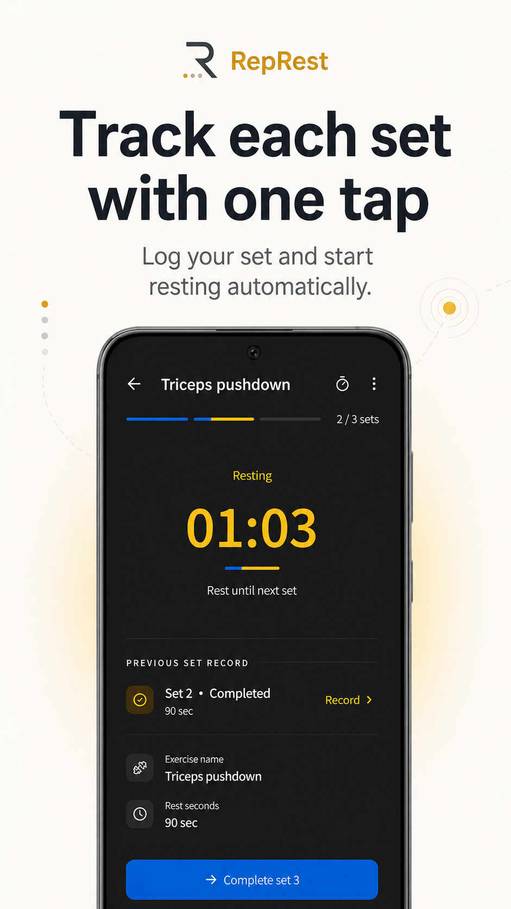
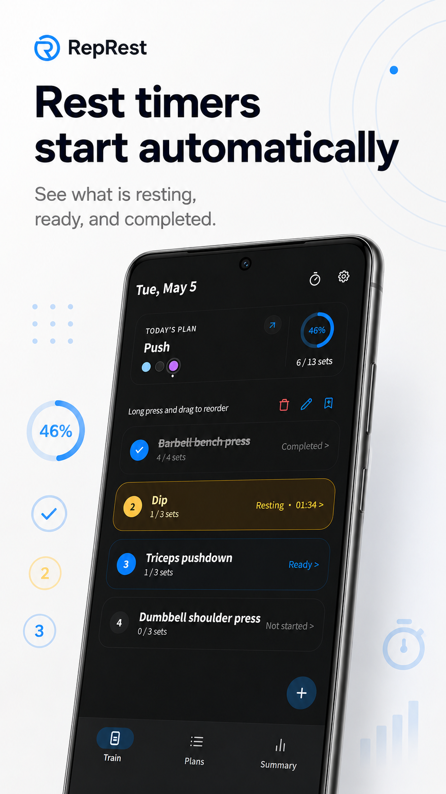
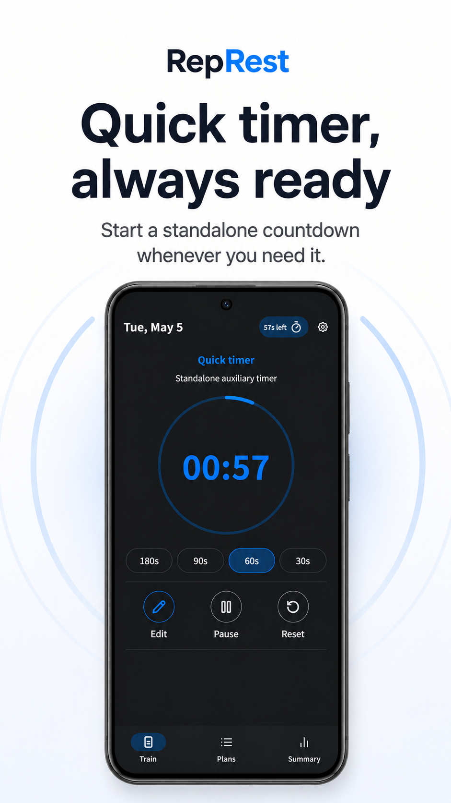
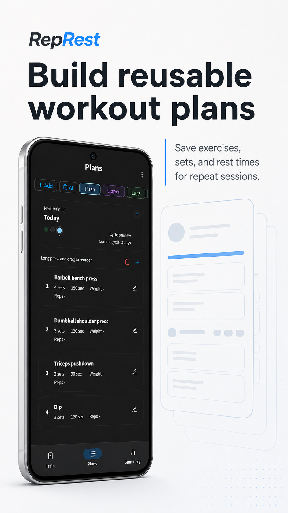
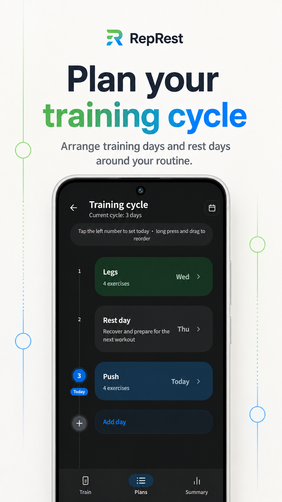
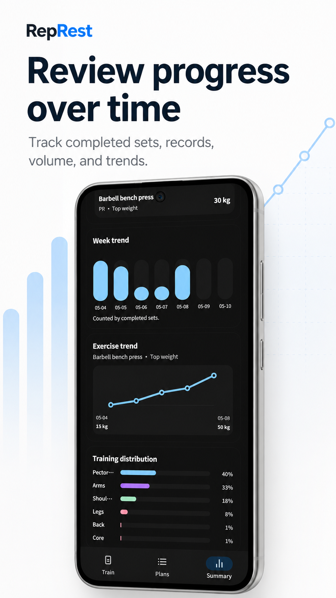

# 组间记 / RepRest

<p align="center">
  
</p>

<p align="center">
  
  
  
  
  
</p>

一款专注力量训练的记录应用：添加今天要练的动作，每完成一组点一下，组间休息自动开始计时。它适合想认真训练、但不想被复杂表格和健身社交打断的人。

组间记可以在浏览器中作为 PWA 使用，也可以打包为 Android 应用。训练数据默认保存在你的设备本地，不需要账号。

## 你可以用它做什么

- 记录今天的训练动作、组数、重量、次数、时长或距离。
- 每完成一组后自动进入组间休息倒计时，减少手动开计时器的打断。
- 保存常用训练计划，下次训练时直接加入今日训练。
- 设置循环日程，例如推、拉、腿、休息，并按自然日自动安排。
- 查看训练总结、训练日历和动作记录，知道自己真实完成了什么。
- 导入或分享训练计划，分享内容不包含训练记录或身体数据。

## 截图

| 记录每一组 | 自动休息计时 | 快捷计时器 |
| --- | --- | --- |
|  |  |  |
| 训练计划 | 循环日程 | 训练总结 |
|  |  |  |

## 为什么可信

- **本地优先**：训练计划、训练记录和设置默认保存在本机。
- **没有账号门槛**：核心训练记录不依赖登录。
- **开源可审计**：源码以 GPL-3.0-or-later 许可证发布。
- **克制的分享**：只有你主动分享计划时，计划内容才会用于生成分享数据；训练记录不会随计划分享。
- **面向实际训练**：界面围绕“今天练什么、完成了几组、何时继续下一组”设计，而不是内容流或社交排名。

## 适合谁

- 用固定训练计划练力量、增肌或康复辅助训练的人。
- 需要组间休息提醒，但不想在训练时反复切换计时器的人。
- 希望记录真实完成情况，而不是维护复杂训练表格的人。
- 希望训练数据尽量留在自己设备上的人。

## 开发运行

安装依赖：

```bash
npm install
```

启动开发环境：

```bash
npm run dev
```

构建：

```bash
npm run build
```

预览 PWA：

```bash
npm run preview
```

预览前请先执行 `npm run build`。

## 配置

复制 `.env.example` 为 `.env` 后按需调整：

```bash
VITE_PLAN_SHARE_API_BASE_URL=https://share.represt.app
VITE_PLAN_SHARE_WEB_BASE_URL=https://share.represt.app
```

这些是前端构建变量，会进入浏览器产物，不要放入密钥。

## Android

项目已接入 Capacitor。同步 Android 工程：

```bash
npm run android:sync
```

打开 Android 工程：

```bash
npm run android:open
```

签名文件、keystore、Android 本地配置和构建产物不应提交到仓库。

## 技术与文档

当前项目使用 React、TypeScript、Tailwind CSS、Vite、Dexie 和 Capacitor。更具体的开发约束、发布流程和图标更新流程见：

- [AGENTS.md](AGENTS.md)
- [docs/release.md](docs/release.md)
- [docs/update-icons.md](docs/update-icons.md)

## 开源许可

Copyright (C) 2026 J.C.Ding

本项目源代码以 GNU General Public License v3.0 or later 开源，详见 [LICENSE](LICENSE)。你可以使用、修改、分发和商业使用本项目；分发修改版本时也必须按 GPL-3.0-or-later 提供相应源码，并保留版权与许可证声明。

项目名称、Logo、图标、截图和商店素材不随源代码许可证授予商标使用权，除非另有明确说明。
