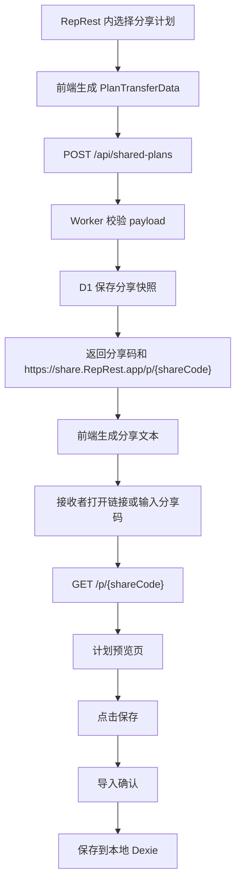

# 分享计划 Cloudflare D1 + Worker 实现方案

## 一句话方案

分享码和短链接指向同一份计划快照；Cloudflare Worker 负责解析分享码、读写 D1，RepRest 前端负责生成分享文本、展示计划预览、确认导入和保存。

## 技术目标

- 分享码短、稳定、易输入。
- 分享链接可直接打开 Web 预览页。
- 分享计划不依赖账号体系。
- 接收者可以先查看完整计划，再决定保存。
- 计划导入复用现有计划转移数据结构。
- Web/PWA 和 Android 使用同一条分享链路。
- 后端只承担分享快照存取、校验和基础风控。

## 推荐架构



## Cloudflare 组件选择

### Worker

Worker 负责：

- 创建分享。
- 读取分享。
- 输出分享预览页或把请求交给前端路由。
- 做基础限流和字段校验。
- 设置 CORS。
- 返回结构化错误。

### D1

D1 负责保存分享快照和少量统计字段。

选择 D1 的原因：

- 分享记录是结构化数据。
- 后续容易加过期、删除、状态、打开次数、版本字段。
- 读取和写入语义清晰。
- 比 KV 更适合做可查询的分享记录管理。

Cloudflare D1 是 Cloudflare 面向 Workers 的 serverless SQL 数据库，Worker 可通过绑定访问 D1。参考：<https://developers.cloudflare.com/d1/>

### 可选组件

- Rate Limiting：用于限制创建分享和读取接口。
- Turnstile：当出现垃圾分享时再加入。
- R2：第一版不需要，除非未来服务端保存海报图片。
- KV：第一版不作为主存储，可用于缓存公开预览数据。

## 域名设计

建议使用独立分享域名：

```text
https://share.RepRest.app/p/{shareCode}
```

也可以挂在主域名：

```text
https://RepRest.app/share/p/{shareCode}
```

推荐独立分享域名，原因：

- 分享链接更短。
- 和 App 主站职责清晰。
- 后续可以单独做缓存、限流和风控。

## 数据模型

### shared_plans

```sql
CREATE TABLE shared_plans (
  code TEXT PRIMARY KEY,
  schema_version INTEGER NOT NULL,
  payload_json TEXT NOT NULL,
  payload_size INTEGER NOT NULL,
  title TEXT NOT NULL,
  summary_json TEXT NOT NULL,
  locale TEXT,
  source TEXT NOT NULL DEFAULT 'RepRest',
  status TEXT NOT NULL DEFAULT 'active',
  created_at TEXT NOT NULL,
  expires_at TEXT,
  last_opened_at TEXT,
  open_count INTEGER NOT NULL DEFAULT 0
);
```

字段说明：

- `code`：分享码，同时作为短链接路径标识，使用不可预测随机值。
- `schema_version`：分享协议版本。
- `payload_json`：完整 `PlanTransferData`。
- `payload_size`：原始 payload 字节数，用于限制体积。
- `title`：预览页标题。
- `summary_json`：计划摘要，列表页或首屏可直接使用。
- `locale`：分享者当前语言。
- `status`：`active`、`blocked`、`expired`。
- `created_at`：创建时间。
- `expires_at`：过期时间。
- `open_count`：粗略打开次数。

### 初始索引

```sql
CREATE INDEX idx_shared_plans_status_expires_at
ON shared_plans(status, expires_at);
```

第一版不需要用户表。

## 分享 payload

前端继续复用现有 `PlanTransferData` 思路：

```ts
type PlanTransferData = {
  plans: PlanTransferPlan[]
  cycle: Array<number | null>
  exerciseModels: PlanTransferExerciseModel[]
}
```

在网络分享层外包一层元信息：

```ts
type SharedPlanPayload = {
  schemaVersion: 1
  app: 'RepRest'
  kind: 'plan-template' | 'training-cycle'
  data: PlanTransferData
}
```

当前开放：

- 一个或多个计划：`kind = 'plan-template'`
- 训练循环：`kind = 'training-cycle'`

## API 设计

### 创建分享

```http
POST /api/shared-plans
Content-Type: application/json
```

请求：

```json
{
  "schemaVersion": 1,
  "kind": "plan-template",
  "locale": "zh-CN",
  "payload": {
    "plans": [],
    "cycle": [],
    "exerciseModels": []
  }
}
```

响应：

```json
{
  "code": "R8K4-2P",
  "url": "https://share.RepRest.app/p/R8K4-2P",
  "expiresAt": "2026-08-05T00:00:00.000Z"
}
```

校验规则：

- `schemaVersion` 必须受支持。
- `kind` 必须是允许值。
- `plans` 至少 1 个。
- 计划分享允许 1 个或多个计划；循环日程分享包含日程和其引用计划。
- 动作数量设置上限。
- payload 字节数设置上限。
- 字段白名单校验。

### 获取分享详情

```http
GET /api/shared-plans/{code}
```

响应：

```json
{
  "code": "R8K4-2P",
  "schemaVersion": 1,
  "kind": "plan-template",
  "title": "Push Day",
  "summary": {},
  "payload": {
    "plans": [],
    "cycle": [],
    "exerciseModels": []
  },
  "createdAt": "2026-05-07T00:00:00.000Z",
  "expiresAt": "2026-08-05T00:00:00.000Z"
}
```

错误：

- `404`：不存在。
- `410`：已过期。
- `403`：被屏蔽。
- `422`：协议版本不支持。

### 分享预览页

```http
GET /p/{code}
```

返回前端页面，由前端再请求详情接口。

第一版可以让 Vite 构建后的前端处理该路由，也可以由 Worker 返回同一个静态入口。

## Worker 行为

### 创建分享时

1. 解析 JSON。
2. 校验协议版本。
3. 校验字段和大小。
4. 生成随机分享码。
5. 生成摘要。
6. 写入 D1。
7. 返回分享码和短链接。

分享码生成要求：

- 使用 Web Crypto。
- 不使用递增 ID。
- 不使用可预测随机数。
- 长度控制在用户可手动输入的范围内。
- 使用不易混淆的字符集，避免 `0/O`、`1/I/l` 等字符。
- 展示时可加分隔符，例如 `R8K4-2P`；存储和匹配时统一归一化。

### 读取分享时

1. 校验分享码格式。
2. 查询 D1。
3. 检查状态和过期时间。
4. 返回 payload。
5. 异步更新打开次数。

Cloudflare Worker 中后置统计可使用 `ctx.waitUntil()`，避免影响主响应。

## Worker 项目结构建议

可以在仓库内新增：

```text
cloudflare/
  plan-share-worker/
    src/
      index.ts
      routes.ts
      shared-plan-schema.ts
      shared-plan-summary.ts
    migrations/
      0001_create_shared_plans.sql
    wrangler.jsonc
    package.json
    tsconfig.json
```

也可以放在独立仓库。

若当前目标是快速验证，建议放在当前仓库内，方便前端类型和分享 payload 同步。

## wrangler 配置要点

需要配置：

- D1 binding。
- 自定义域名路由。
- compatibility date。
- observability。
- 环境变量：允许的前端 Origin、分享链接 base URL、默认过期天数。

Cloudflare Worker 配置和 D1 binding 以官方文档为准。参考：

- Workers：<https://developers.cloudflare.com/workers/>
- D1：<https://developers.cloudflare.com/d1/>
- Wrangler：<https://developers.cloudflare.com/workers/wrangler/>

## RepRest 前端需要修改

### 1. 计划分享入口

位置：

- `src/pages/PlansPage.tsx`
- 计划详情或计划列表相关组件。

新增行为：

- 用户点击分享。
- 选择当前计划。
- 创建分享。
- 打开分享文本面板。

计划分享支持选择一个或多个计划。

### 2. 复用导出数据

位置：

- `src/lib/plan-transfer-data.ts`
- `src/lib/plan-transfer-types.ts`

现有能力：

- `buildPlanTemplateExport(planIds)` 可生成计划转移数据。
- `importPlanTransferData(data)` 可导入计划。

新增建议：

- 增加分享层类型 `SharedPlanPayload`。
- 增加摘要生成函数，例如 `buildSharedPlanSummary(data)`。
- 保持现有 JSON 导入导出结构可用。

### 3. 分享 API client

新增文件：

```text
src/lib/plan-share-api.ts
```

职责：

- 创建分享。
- 获取分享详情。
- 处理 API 错误。
- 根据环境变量读取分享服务 base URL。

### 4. 分享文本生成

新增组件或工具：

```text
src/components/plans/PlanShareSheet.tsx
src/lib/plan-share-text.ts
```

职责：

- 展示将要发送的分享文本。
- 生成包含计划摘要、分享码和链接的文本。
- 复制链接。
- 复制分享码。
- 调起系统分享。

第一版不新增依赖：

- 不引入二维码库。
- 不生成 PNG。
- 不请求摄像头或相册权限。

### 5. 计划分享预览页

新增页面：

```text
src/pages/SharedPlanPage.tsx
```

新增路由：

```text
/share/:code
```

或在分享域名下使用：

```text
/p/:code
```

页面职责：

- 拉取分享详情。
- 展示完整计划。
- 根据平台展示保存入口。
- 点击保存进入导入确认。
- 保存后跳转计划页。

### 6. App 内输入分享码

新增入口：

- 计划列表的新增或更多菜单。
- 导入相关入口。

页面职责：

- 接收用户输入的分享码。
- 归一化大小写和分隔符。
- 拉取分享详情。
- 进入计划预览和导入确认。

### 7. 导入确认复用

位置：

- `src/components/plans/PlanJsonImportSheet.tsx`
- `src/lib/plan-transfer.ts`

建议：

- 抽出通用的 `PlanImportConfirmSheet`。
- JSON 导入和分享导入都使用同一套确认 UI。
- 分享导入不要求用户手动粘贴 JSON。

### 8. i18n 文案

位置：

- `src/locales/zh-CN/common.ts`
- `src/locales/en/common.ts`

新增文案：

- 分享计划。
- 生成分享。
- 分享码。
- 输入分享码。
- 复制链接。
- 复制分享码。
- 保存这个计划。
- 查看完整计划。
- 添加到主屏幕。
- 分享已过期。
- 计划版本暂不支持。

所有用户可见文案走 i18n。

### 9. PWA 行为

需要支持：

- 分享页在浏览器可完整查看。
- 未安装时仍可保存到本地 Dexie。
- iPhone 展示添加到主屏幕引导。
- 内置浏览器下保留查看能力。

不建议第一版强依赖安装检测。

### 10. Android 行为

需要支持：

- 系统分享入口。
- 链接优先打开 Web 计划预览。
- App 内输入分享码导入。

可能涉及：

- 后续如果要增强 App Links，再配置 Capacitor App URL open listener 和 Android manifest intent filter。

第一版先用 Web 链路和 App 内分享码跑通，不要求链接直接唤起 App。

## 前端环境变量

建议新增：

```text
VITE_PLAN_SHARE_API_BASE_URL=https://share.RepRest.app
VITE_PLAN_SHARE_WEB_BASE_URL=https://share.RepRest.app
```

本地开发：

```text
VITE_PLAN_SHARE_API_BASE_URL=http://localhost:8787
VITE_PLAN_SHARE_WEB_BASE_URL=http://localhost:8787
```

## 安全与风控

### 创建分享

- 限制 payload 大小。
- 限制计划数量。
- 限制动作数量。
- 字段白名单。
- 拒绝 HTML 注入内容。
- 限制请求频率。

### 读取分享

- 不执行 payload 中任何脚本。
- 所有文本按纯文本渲染。
- 保存前展示确认。
- 协议版本不支持时显示明确错误。

### 隐私

- 分享前展示隐私提示。
- 分享快照只包含计划模板。
- 不包含训练记录、身体数据、历史完成情况。
- 分享链接可设置默认过期时间。

## MVP 实施顺序

### 第 1 步：前端分享数据和确认页

目标：

- 能从现有计划生成分享 payload。
- 能从分享 payload 预览计划。
- 能确认后保存到本地。

验证：

- 本地构造 payload 后可以保存为新计划。

### 第 2 步：Worker + D1 创建和读取分享

目标：

- `POST /api/shared-plans` 可创建分享。
- `GET /api/shared-plans/{code}` 可读取分享。
- D1 可持久保存。

验证：

- 本地 wrangler dev 可创建和读取。
- 线上部署后可通过分享码和短链接获取同一份计划。

### 第 3 步：分享预览页

目标：

- 打开链接能看到完整计划。
- 过期、缺失、版本不支持都有页面状态。

验证：

- Web、PWA、Android WebView 都可查看。

### 第 4 步：分享文本和分享码入口

目标：

- 生成可读分享文本。
- 分享文本包含计划摘要、分享码和链接。
- 支持复制链接、复制分享码和系统分享。
- App 内可输入分享码进入预览。

验证：

- 聊天软件中分享文本可读，链接可打开，分享码可手动输入。

### 后续：Android 增强

目标：

- App 内分享体验更顺。
- 后续可让链接打开到 App 内对应页面。

验证：

- Android 真机可从分享链接进入 Web 计划预览。

## 第一版验收标准

- 用户能从一个或多个计划生成分享链接。
- 用户能生成包含计划摘要、分享码和链接的分享文本。
- 其他用户打开链接后能查看完整计划。
- App 内用户输入分享码后能查看完整计划。
- 其他用户保存前能看到确认页。
- 保存后本地出现新计划。
- 分享链接或分享码过期、不存在时有明确提示。
- `npm run build` 通过。
- Worker 本地和线上基本接口验证通过。

## 关键取舍

### 为什么第一版不做二维码和海报

第一版只做分享文本、分享码和链接。

理由：

- 用户可以直接点链接进入 Web 预览。
- 已安装 App 的用户可以手动输入分享码。
- 不需要请求摄像头权限。
- 不需要引入二维码和图片生成依赖。
- 分享文本更适合聊天软件和社群转发。
- 支持未来版本兼容。
- 支持过期和风控。

### 是否需要账号

第一版不需要账号。

理由：

- 分享者不需要登录才能分享。
- 接收者不需要登录才能查看。
- 保存到本地即可验证功能价值。

### 是否需要后端

需要一个轻量分享服务。

理由：

- 分享码和分享链接需要解析到计划快照。
- 后续增长和风控都需要服务端入口。

这个服务可以由 Cloudflare Worker + D1 承担，不需要传统服务器。

## 后续扩展

功能验证后再考虑：

- 分享链接撤回。
- 分享统计。
- 公开模板页。
- 教练分享身份。
- 自定义品牌分享物料。
- 云同步。
- 多设备保存。

## 参考资料

- Cloudflare Workers：<https://developers.cloudflare.com/workers/>
- Cloudflare D1：<https://developers.cloudflare.com/d1/>
- Wrangler：<https://developers.cloudflare.com/workers/wrangler/>
- Cloudflare D1 Workers binding：<https://developers.cloudflare.com/d1/worker-api/>
